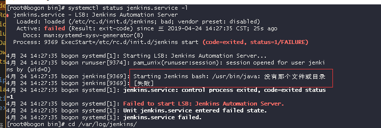
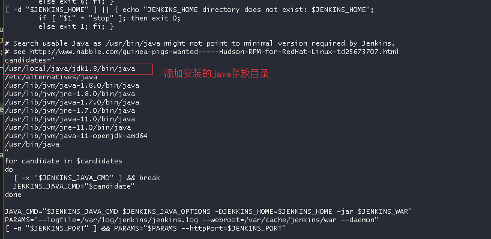
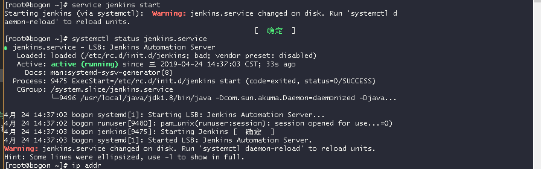
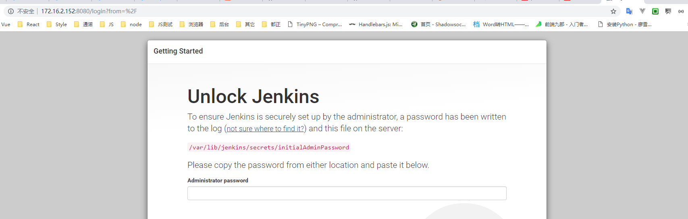
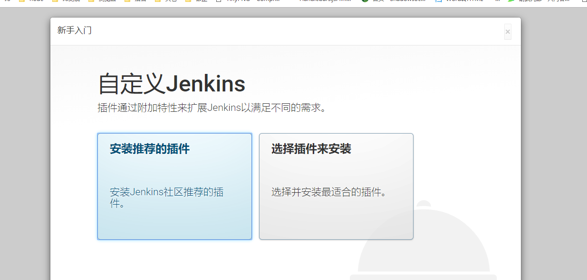
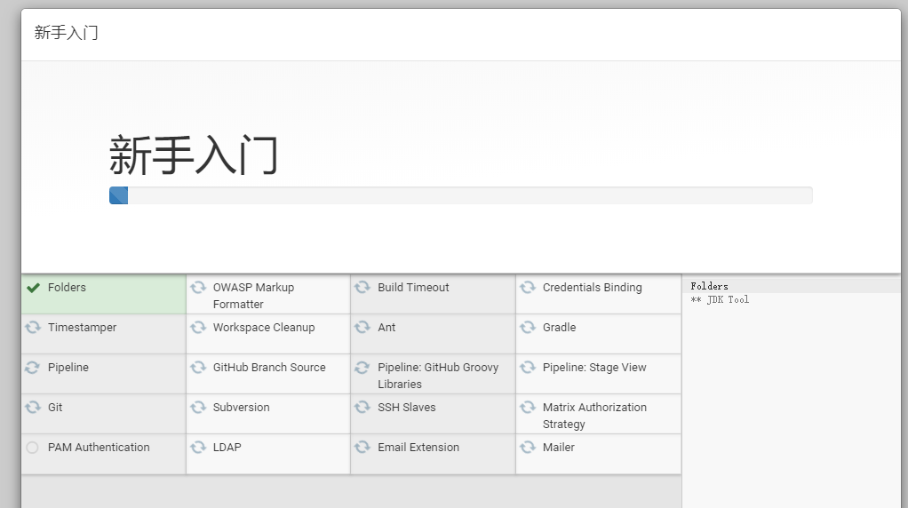
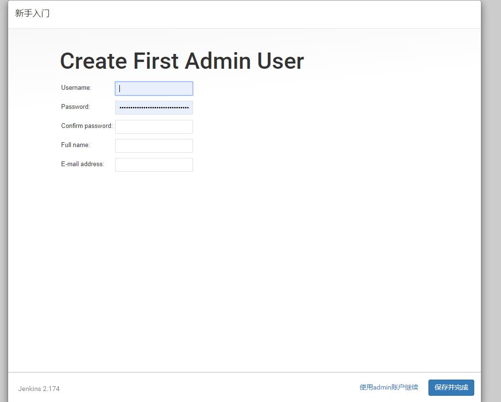

## Centos 下安装 Jenkins

### 安装 JAVA

  查看当前是否安装JAVA运行环境: JDK

    java 或者 javac
    java -version  查看当前版本 (jdk 需要 1.8 以上版本)

  如果没有安装需要先安装 JDK, 并配置相关环境

### 安装最新版本 Jenkins

  1. 添加 Jenkins 源

    sudo wget -O /etc/yum.repos.d/jenkins.repo http://jenkins-ci.org/redhat/jenkins.repo

    sudo rpm --import http://pkg.jenkins-ci.org/redhat/jenkins-ci.org.key

  2. 使用 yum 安装 

    yum install jenkins

### 启动 Jenkins

    sudo jenkins start

  可能会出现的问题:  安装了java运行环境后，仍然倒报如下错误

原因: 找不到jdk目录报错

vi /etc/init.d/jenkins 添加 jdk 目录

重新启动:

    sudo service jenkins start

停止 Jenkins 服务:

    sudo service jenkins stop

### Jenkins 相关配置

jenkins 安装目录

    /var/lib/jenkins

jenkins 配置文件地址

    /etc/sysconfig/jenkins

### 访问 Jenkins (默认端口: 8080, 如需修改: vi /etc/sysconfig/jenkins)

访问 /var/lib/jenkins/secrets/initialAdminPassword 获得初始密码

选择安装 Jenkins 插件，推荐安装推荐的插件;

成功后，输入用户和密码 (username: admin, password: admin123)

保存成功后，进入主界面

