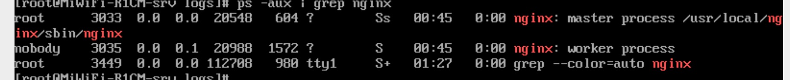

## Centos7下安装Nginx

### 安装步骤

  ### 1. 检查并安装所需要的依赖软件

      1.1 gcc: nginx编译依赖gcc环境

          安装命令: yum install gcc-c++

      1.2 pcre(Perl Compatible Regular Expressions)是一个Perl库, 包括perl兼容的正则表达式库。 nginx的http模块使用 pcre 来解析正则表达式。

          安装命令: yum install -y pcre pcre-devel

      1.3 zlib: 提供很多压缩和解压的方式， nginx使用zlib对http包的内容进行gzip；

          安装命令: yum install -y zlib zlib-devel

      1.4 openssl: 一个强大的安全套接字层密码库，囊括主要的密码算法、常用的密钥和证书封装管理功能及SSL协议，并提供丰富的应用程序供测试或其它目的使用。nginx不仅支持http 协议，还支持https（即在ssl协议上传输 http）

          安装命令: yum install -y openssl openssl-devel

  ### 2. 下载nginx源码包

    下载命令: wget https://nginx.org/download/nginx-1.14.2.tar.gz

  ### 3. 解压源码包至 /usr/local目录下
    3.1 cd 至 /usr/local目录下
      解压缩: tar -zvxf nginx-1.14.2.tar.gz

    3.2 更改目录
      mv ./nginx-1.14.2 ./nginx

    3.3 cd ./nginx

    3.4 配置编译参数命令

  **** 注意事项 ： 安装之前需要先手动创建如下目标:  /var/temp, /var/temp/nginx
    命令: mkdir -p /var/temp/nginx

      ./configure \
      --prefix=/usr/local/nginx \
      --pid-path=/var/run/nginx.pid \
      --lock-path=/var/lock/nginx.lock \
      --error-log-path=/var/log/nginx/error.log \
      --http-log-path=/var/log/nginx/access.log \
      --with-http_gzip_static_module \
      --http-client-body-temp-path=/var/temp/nginx/client \
      --http-proxy-temp-path=/var/temp/nginx/proxy \
      --http-fastcgi-temp-path=/var/temp/nginx/fastcgi \
      --http-uwsgi-temp-path=/var/temp/nginx/uwsgi \
      --http-scgi-temp-path=/var/temp/nginx/scgi

      or 

      ./configure --prefix=/usr/local/nginx --with-http_stub_status_module --with-pcre  --with-http_ssl_module

  *** 回车，等待安装

  ### 3.5 编辑并安装

    命令: make && make install

  执行完后 进入 /usr/local/nginx 目录, 如有 conf, sbin, html文件夹，则表示安装成功。

  ### 4 基本使用

    4.1 启动nginx

        cd /usr/local/nginx/sbin
        ./nginx

    4.2 查看是否启动成功

        ps -aux | grep nginx

  

    4.3 停止nginx

        cd /usr/local/nginx/sbin && ./nginx -s quit

    4.4 测试 nginx 是否安装成功
        1) 查看ip地址，即 ifconfig

        2) 浏览器输入ip后，显示如下表示成功

  

*** 注意事项: nginx重新启动后，nginx可以会报: open() "/var/run/nginx/nginx/pid" failed（2： No such file or directory）

解决方法:  cd /usr/local/nginx/conf 目录
          vi nginx.conf

          #pid logs/nginx.pid 改成
          pid /usr/local/nginx/logs/nginx/pid;

### 5. 设置nginx开机启动

  5.1 添加新文件， nginx.service

    vi /lib/systemd/system/nginx.service

    [Unit]
    Description=nginx
    After=network.target

    [Service]
    Type=forking
    ExecStart=/usr/local/nginx/sbin/nginx
    ExecReload=/usr/local/nginx/sbin/nginx -s reload
    ExecStop=/usr/local/nginx/sbin/nginx -s quit
    PrivateTmp=true

    [Install]
    WantedBy=multi-user.target

  5.2 更改文件权限

    chmod 745 /lib/systemd/system/nginx.service

  5.3 设置开机启动

    systemctl enable nginx.service

*** 如果在虚拟机上安装成功并启动后， 在浏览器中打开时， 此时页面会显示无法加载页面，这时需要配置linux防火墙。

CentOS7.0以上默认firewall为防火墙配置, 此处只改iptables配置

### 1. 安装iptables服务

    yum install iptables-services

### 2. 修改 iptables 文件

    vi /etc/sysconfig/iptables

  加入以下端口，22是默认存在的；这里要把21端口也加进去，不加入会导致nginx服务启动之后访问不了主界面

    -A INPUT -p tcp -m state --state NEW -m tcp --dport 21 -j ACCEPT

    -A INPUT -p tcp -m state --state NEW -m tcp --dport 80 -j ACCEPT

    -A INPUT -p tcp -m state --state NEW -m tcp --dport 8080 -j ACCEPT

    -A INPUT -p tcp -m state --state NEW -m tcp --dport 443 -j ACCEPT

  保存重启 iptables服务

      systemctl restart iptables.service

  设置防火墙开机启动

      systemctl enable iptables.service

  *** 注意点： 重启后，防火墙被打开， 所以要设置禁止防火墙开机自动开启

  停止 firewall

      systemctl stop firewalld.service

  禁止 firewall 开机启动

      systemctl disable firewalld.service

  **** 有时不好使的话，重新启动linux服务  shutdown -r now

