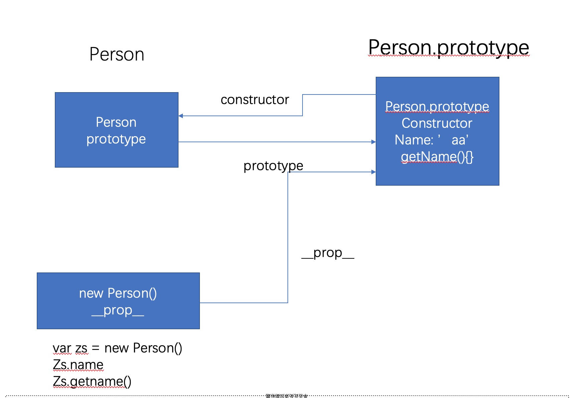

## 1. 闭包
  概念: 部内部函数访问外部函数的变量并返回内函数, 有效的保护了内部变量; <br />
  注意事项: 闭包函数调用后不会被垃圾回收机制主要回收，所以再调用了函数后如果不手动实现 fn = null，会造成内存泄漏;
  ````
    function outFunc () {
      var numb = 0;
      return innerFunc () {
        numb++;
        console.log(numb);
      }
    }

    var fn = outfunc();
    fn(); -> 1
    fn(); -> 2
    fn(); -> 3;

    // 函数调用后手动关闭, 防止函数一直存在，造成内存泄漏
    fn = null;
  ````

## 原型链
  ### 构造函数，原型对象，实例对象的关系图
  
  当对象和原型中都有一个相同的变量时，对象属性优先级高
  ```
    function Person () {
      this.name = '张三'
    }
    Person.prototype.name = '李四'
    var person = new Person();
    person.name => '张三'
  ```

## 面向对象编程
```
  1. 面向对象编辑时，ES5中没有类的概念，所以使用函数来代替
  2. 原型对象上有一个constructor属性，此时的这个constructor就是那个函数
  3. property原型传递给Object.create()方法时，传递的是原型链的副本(值引用)
  4. js中除了 number, string, boolean 按值传递，其它的都是按引用传递
  5. es5中改变this指定的方式有三种： call, apply, bind
  需要注意的： 当使用bind改变this指向时，返回的是一个新函数，些时应该调用返回的这个新函数
    var a = {
      age: 20,
      getAge: function () {
        return this.age;
      }
    };
    var b = {
      age: 40
    }

    var c = a.getAge.bind(b);
    c() => 40
  6. es5中同时申明变量和函数时，函数提升的优先级高于变量
    function test () {
      var a = 30;
      function a () {}
      console.log(a); -> 30
    }
    js执行的原理：
      function test () {
        // 先提升函数
        function a () {}
        var a;
        a = 30;
        console.log(a) -> 30
      }
  7. js为单线程，在执行代码时，必须先等同步队列中的代码执行完后，才执行异步队列中的代码；
    异步代码： setTimeout/setInterval, ajax, 事件
```

## JS原型继承
```
  function Car (color) {
    this.color = color;
  }
  // 原型链写法
  Car.prototype.sail = function () {
    return this.color + '';
  }
  // 对象字面量写法，些时应当改变constructor指定，不指定默认指向Object
  Car.prototype = {
    constructor: Car,
    sail: function () {}
  }


  function BWM (color) {
    Car.call(this, color); // 继承父类的属性
   // Car.apply(this, arguments);
  }
  // 继承父类方法
  1. 直接继承父类实例对象
    BWM.prototype = new Car();
    缺点:
     (1) 重新实例化对象一次， 加上继承，父类共实例化两次
     (2) new Car()实例对象 通过 __proto__ 指向 Car.prototype原型对象， 此时如果在 BWM.prototype中添加方法会同步添加到父类的原型上(值引用)
  2. 改进方案
  var __proto = Object.create(Car.prototype); // __proto.constructor -> Car
  __proto.constructor = BWM; // 更改构造函数指向
  BWM.prototype = __proto;
  var bwm = new BWM('red');
  bwm.sail(); => 'red======'
```
