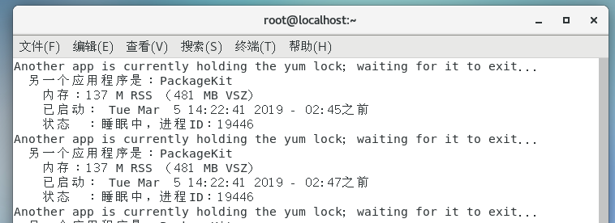

## win下VMware安装Centos
  ### CentOS执行ping命令报错 name or service not know 解决办法
    1） 添加DNS服务器
      进入 vi /etc/resolv.conf， 添加如下代码
        nameserver 114.114.114.114
        nameserver 114.114.114.115
      :wq保存退出
    
    2）设置配置文件
      vi /etc/sysconfig/network-scprits/ifcfg-ens33
      修改  ONBOOT=yes
      :wq退出保存
    
    3）重启网络
      service network restart

    4) 测试  ping www.baidu.com -> 接收到报文，配置成功

  ### Centos 下安装 wget
    yum -y install wget

  ### Centos 下安装 node
    1) 添加官方的yum源
      curl -sL https://rpm.nodesource.com/setup_11.x | bash -

    2）yum命令安装
      yum install -y nodejs

    3) 查看版本
      node -v

    可能出现问题： yum在锁定状态中
    
    解决： rm -f /var/run/yum.pid
   
  
    

  ### yum-config-manager命令找不到
    yum-config-manager命令在 yum-utils包里， 系统默认没有安装这个命令

    yum -y install yum-utils

  ### Centos安装SublimeText3
    1) 安装GPG公钥

    rpm -v --import https://download.sublimetext.com/sublimehq-rpm-pub.gpg

    2）选择Stable版

      yum-config-manager --add-repo https://download.sublimetext.com/rpm/stable/x86_64/sublime-text.repo

    3）安装

      yum install sublime-text

  ### Centos安装xampp
    1. 下载XAMPP

    wget https://sourceforge.net/projects/xampp/files/XAMPP%20Linux/7.3.0/xampp-linux-x64-7.3.0-0-installer.run

  ### Centos安装VSCode
    1) sudo rpm --import https://packages.microsoft.com/keys/microsoft.asc

    2) sudo sh -c 'echo -e "[code]\nname=Visual Studio Code\nbaseurl=https://packages.microsoft.com/yumrepos/vscode\nenabled=1\ngpgcheck=1\ngpgkey=https://packages.microsoft.com/keys/microsoft.asc" > /etc/yum.repos.d/vscode.repo'

    3) yum check-update

    4) sudo yum install code

    5) 创建桌面应用

      cd /usr/share/applications , 将 VSCode 图标右键复制到桌面即可，首次启动需要信任的启动后， 启动后桌面的图标会变成 VS Code图标

  ### Centos安装Google浏览器
    1） cd /etc/yum.repos.d
    2)  vi google-chrome.repo

      [google-chrome] 
      name=google-chrome 
      baseurl=http://dl.google.com/linux/chrome/rpm/stable/$basearch 
      enabled=1
      gpgcheck=1 
      gpgkey=https://dl-ssl.google.com/linux/linux_signing_key.pub

    3) yum -y install google-chrome-stable --nogpgchecke
      
  