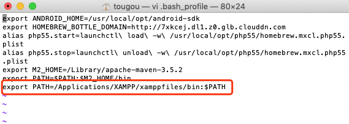
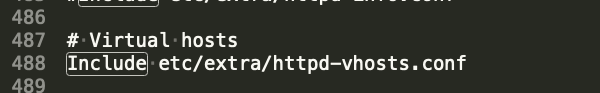
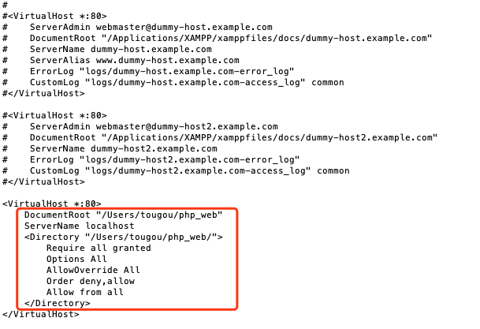
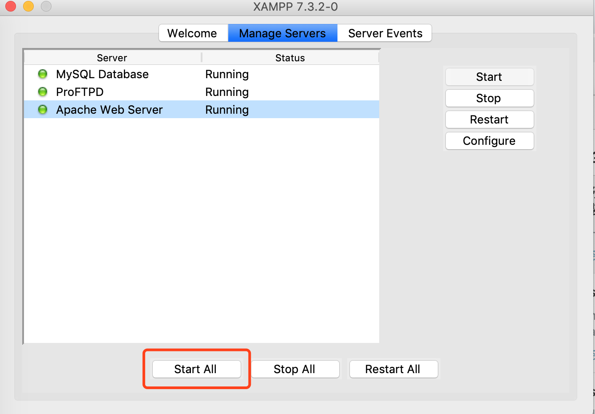
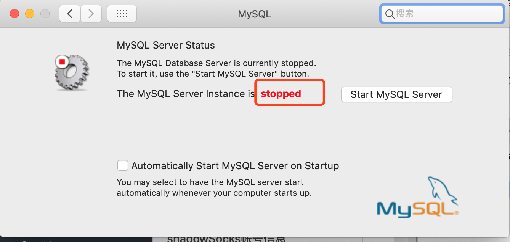

## 1、下载XAMPP并安装
  [XAMPP]( https://www.apachefriends.org/download.html) ,选择PHP7.3.2
  ### 安装注意事项
    1. Mac默认安装至 /Application/Xampp 目录下
    2. 选择
        XAMPP Core file 核心文件，包含apache, mysql文件等
        Xampp Developer Files 开发依赖文件
    3. 成功后 重启apache服务

## 2、设置启动的PHP, mac系统自带安装 php, 一般与 XAMPP 自还的版本号不一致
  php -v : 查看当前系统默认的php  
  在命令行中修改 .bash_profile文件， 更改php  
  export PATH=/Applications/XAMPP/xamppfiles/bin:$PATH   
  

## 3、设置Apache的VirtualHost （在当前操作目录下）
 1. 进入 XAMPP 安装目录  /Applications/XAMPP/etc
 2. vi httpd.conf, 取消 Virtual hosts 下的Include注释  
  
 3. 切换至 extra 目录下修改 http-vhosts.conf配置文件 
  

## 4、重启 apache 并验证

## 5、 启动所有
  

### 注意事项
  1. 启动前，若本地安装了mysql,先关闭本地mysql服务，避免冲突  
    
  2. 若要使用 Xampp 自带的数据库： phpmyadmin，则忽略 第 3 步
