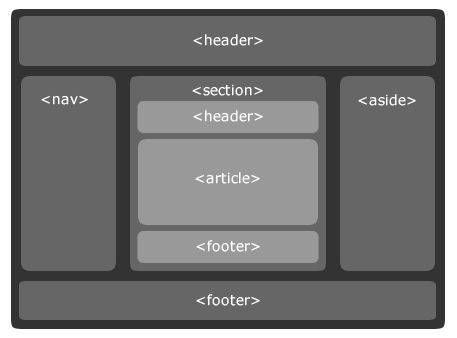

## 同源策略知识
```
  1. 同源策略： 协议, 域名, 端口号相同;
  2. 浏览器不同的域名不能访问对应的cookie,但是内部的表单没有限制;
  3. 同源策略限制的对象(跨域):
    (1) Cookie、LocalStorage和IndexDB无法读取
    (2) DOM无法获得
    (3) Ajax请求不能发送

  4. 如何设置同源策略 (hosts)
    // 前端能过js实现
    test.example.com/a.html
      <script>
        document.domain="example.com"  // 设置同源策略
        document.cookie="test1=hello"
      </script>
    test2.example.com/b.html
    <script>
    const _cookie = document.cookie
    </script>
    // 另一种方式，后台设置domain; 最最实用的方式
    Set-Cookie: key=value; domain=.example.com;

    5. 突破同源策略
      (1) html标签
        img / iframe / script(jsonp) / link(background)
```
## jsonp 实现原理
  在文档中插入一个 script 标签， 创建 _callback 回调函数， 通过服务器配合执行 _callback 方法，并传入一些参数;

  1. 创建一个 _callback 函数
  2. 插入 script 标签至 页面中
  3. 服务器输出js

## HTML语义化
  ### 什么是语义化
    根据文档的内容， 选择合适的标签 便于开发者写规范化的代码， 同时让浏览器爬虫和机器更好的解析;

  ### 为什么要语义化
    1. 当在没有加载css样式时，页面能够呈现出很好的内容结构
    2. 有得SEO: 爬虫依赖于标签来确定上下文内容和关键字的权重
    3. 方便其它设备解析, 如(屏幕阅读器、盲人阅读器等)
    4. 有利于代码规范及维护

  ### 注意事项
    1. 尽量少的使用无语义的标签 div 与 span
    2. 在语义不显示时， 可以使用div和p标签时，尽量用p， p在默认情况下会有上下间距，对兼容特殊终端有利
    3. 用css样式代替纯样式标签： b, font, u等
    4. 需要强调的文本， 可以使用 strong(加粗，不使用了) 或者 em(斜体，不使用i)
    5. input标签对应的说明应使用label标签

  ### HTML5常用的语义标签
    1. header: 页眉，应作为介绍内容或者导航链接的容器
    2. nav: 导航区域，包含多个超链接，一般出现在页眉或页脚
    3. article: 文章，杂志、博客等，在页面中独立分配，可复用的结构
    4. aside: 侧边栏或嵌入的内容
    5. footer: 页脚， 一般包含版权，作者，地址等信息
    6. section: 文档中的一个区域或者章节

  ### 页面布局
  
